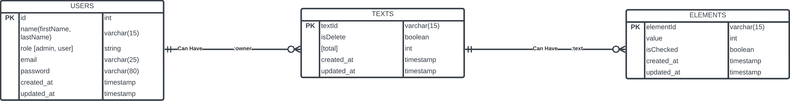
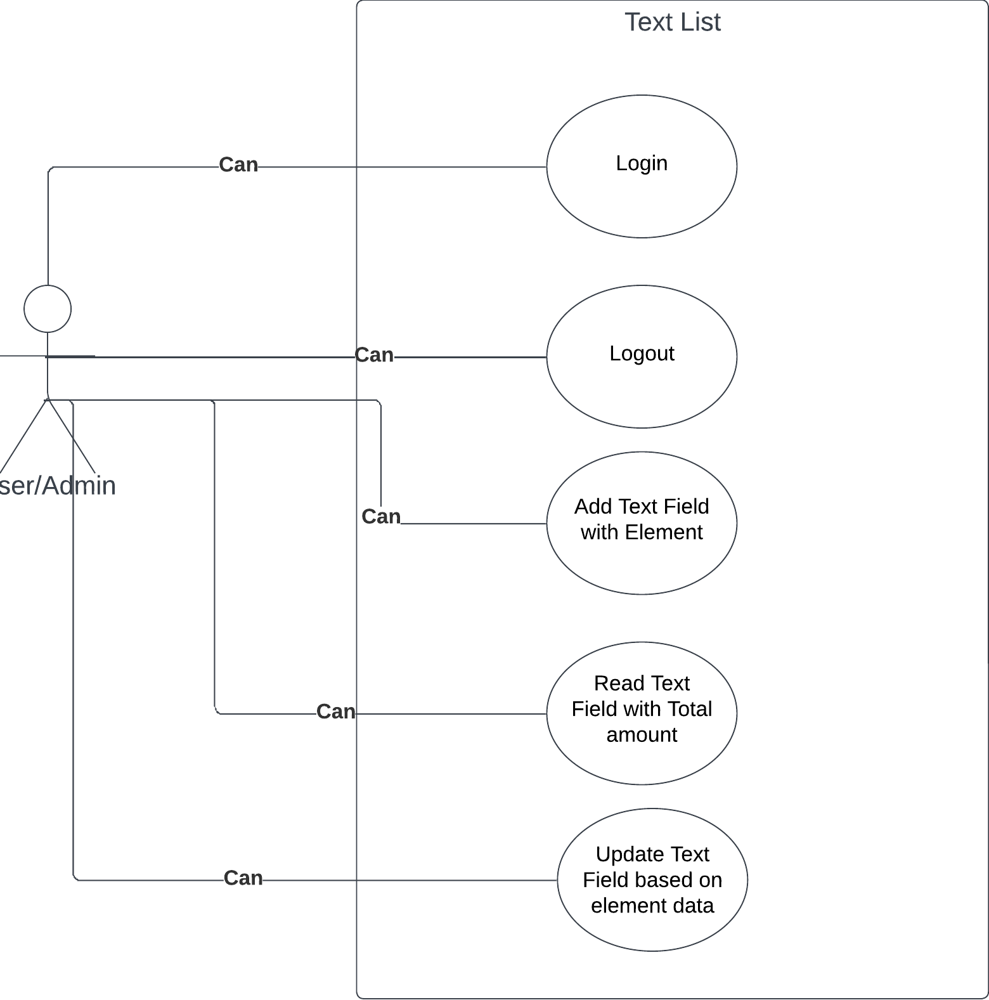

# Maliha-poly-tex-fiber-industry-limited Task with NodeJS TypeScript Express and MySQL(TypeORM)

Developer Ready: A Text List CRUD APP for Maliha-poly-tex-fiber-industry-limited.

## Tech Stack

**Language:** TypeScript

**Server:** Node, Express

**DataBase:** mySQL, typeorm

## Key Feather

**User will decide, how much textbox will need.**

**When user will press Add Textbox button, you will take the input field number and then generate number of text boxes with checkboxes dynamically.**

**After generate the text boxes, user will give the input number in those text boxes and then select the checkbox.**

**Based on selected checkboxes, user will see the output that, number of positions they selected and what is the total number of that selected text boxes.**

**This total number will save in the database**

**For Update the Information, at first in UI all the information need to retrieve from the database. And then again same process as user did for save operation. User uncheck the textbox or increase/decrease the textbox field as well. Based on uncheck & textbox increase/decrease, the information saves in the database.**

## Run Locally

Clone the project

```bash
  git clone https://github.com/SYShopnil/express-typescript-typeORM-code-base.git
```

Go to the project directory

```bash
  cd express-typescript-typeORM-code-base
```

Install dependencies (Development)

```bash
  npm install
```

Start the tsc

If dist folder not exist

```bash
  npm run dev:watch
```

If dist folder exist

```bash (No Time)
  npm run watch
```

Start the server

```bash
  npm run dev
```

Production development

```bash
  npm run build:production
```

Then

```bash
  npm run start
```

## Environment Variables

To run this project, you will need to add the following environment variables to your .env file

**`PORT`** //this will be the server port

**`DB_TYPE`** //this will be data base type example: mysql

**`DB_HOST`** //this will be the hosting server Example: localhost

**`DB_PORT`** //this will be the database server port Example: 3306 (default for xampp)

**`DB_USER_NAME`** //this will be the databse user name Example: `root` for xampp sever default

**`DB_NAME`** //this will be the databse name. At first user need to create a database and then insert the name here Example:airQuality (a random databse name)

**`DB_PASSWORD`** //this is database password for local this is optional

**`TOKE_EXPIRE_IN`** //this will be jwt token expire time. It is count in Days Example: `"5d"`

**`JWT_CODE`** // this will the jwt toke's secrete code

**`AUTH_COOKIE_EXPIRE_IN`** //this will also a expire time of cookies It is also count in Days Exapmle: `5` mean **`5` days**

**`CORS_ORIGIN`** //this will be the cors origin basicially the client site base url. Exapmle : `"http://localhost:3000"` Deafult base url of next js

**`SERVER_BASE_URL`** `** //this will be the server's base url. Example: `"http://localhost:3030"`

**`CORS_ORIGIN`** `** //this will be the client's base url. Example: `"http://localhost:3000" For NextJS`

## ERD Diagram



## Use Case Diagram



## API Reference

#### Create user

```http
  POST /user/create
```

| Parameter          | Type     | Description                |
| :----------------- | :------- | :------------------------- |
| `first_name`       | `string` | **Required**. Your API key |
| `last_name`        | `string` | **Required**. Your API key |
| `email`            | `string` | **Required**. Your API key |
| `password`         | `string` | **Required**. Your API key |
| `confirm_password` | `string` | **Required**. Your API key |
| `role`             | `string` | **Required**. Your API key |
| `profile_pic`      | `string` | **Required**. Your API key |

#### login user

```http
  POST /auth/login
```

| Parameter  | Type     | Description                |
| :--------- | :------- | :------------------------- |
| `email`    | `string` | **Required**. Your API key |
| `password` | `string` | **Required**. Your API key |

### Documentation

[Swagger Link](https://maliha-poly-tex-fiber-industry-limited.onrender.com/docs/)

## Support

For support, email sadmanishopnil@gmail.com.
